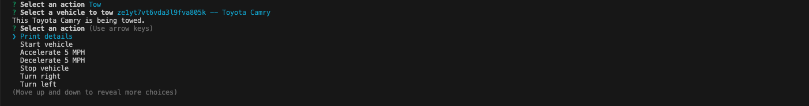

 
[](https://opensource.org/licenses/MIT)

# My Garage

## Description

My Garage is a NODE.js application unsing the Typescript and Inquirer packages where a user can create vehicles to add to their garage and then select those vehicles in order to do something with them, such as start, accelerate, decelerate, or turn.

## Table of Contents

- [Installation](#installation)
- [Usage](#usage)
- [License](#license)
- [Contributing](#contributing)
- [Tests](#tests)
- [Questions](#questions)

## Installation

To install this application, download the zip file for the source code from the GitHub repository, or clone the repository files to your local machine using the command line interface.

## Usage

To use this application, open the locally stored code in VS Code. NODE.js is needed to run this application. If you do not already have NODE.js installed on your local machine, you can find instructions on how to install it in this article: [NodeJS Installation Guide](https://coding-boot-camp.github.io/full-stack/nodejs/nodejs-installation-guide). Once you have NODE.js installed and ready to use, right click on the "Source_Code" folder and select "Open in Integrated Terminal".


Next, we need to install the "Inquirer" and "Typescript" packages from NODE.js. The dependencies are already in place, so all you need to do is to type ```npm install``` into the terminal, press Enter, and both packages will install.

You should now be ready to run the application. To do this, type ```npm start``` into the terminal and press Enter. The application will load and give you the choice to create a vehicle or to select an existing vehicle.


A default Toyota Camry will exist in the "Select an Existing Vehicle" choice.


When you select "Create a new vehicle", you will have the choice to create a car, truck, or motorbike.


For this example, I will add a truck. To do this, I will select "Truck" and then fill out the fields as I am prompted to.


Some things to note, a truck will ask for a towing capacity but a car or motorbike will not. A motorbike will ask for wheel sizes and tire brands but a car or truck will not. 

Now that I have created my truck, I can do things with it. Following the prompt, I can print the vehicle details...


... or perform actions on it such as start it, accelerate 5 mph at a time, decelerate 5 mph at a time, stop the vehicle, turn it left or right, or reverse it. Additionally, options exist to tow a vehicle, which only works if the vehicle selected is a truck, or to perform a wheelie, which only works if the vehicle selected is a motorbike. 

If the vehicle you select is a truck and the action you select is tow, you will be asked to select a vehicle to tow. 


If the vehicle you select to tow is the truck you are towing with, a message will display saying "This truck cannot tow itself!".


If the vehicle you select to tow is not the truck and weighs less than the towing capacity of the truck, a message will display saying that the vehicle is being towed.



If the vehicle you select to tow with is not a truck, you will receive an error message.


Similarily, if the vehicle you select is a motorbike and the action you select is a wheelie, a message will display saying that your motorcycle is doing a wheelie.


If the vehicle you select to perform a wheelie with is not a motorbike, you will receive an error message.


Lastly, you will have the choice to "Select or create another vehicle" or "Exit" on the action list. Selecting "Select or create another vehicle" will take you back to the beginning of the application where you can switch vehicles or create a new vehicle. Selecting "Exit" will close the application. 

This touches on the basic functionality of the application user process. Feel free to experiment with the different choices and observe the reactions!

To watch a video demo on how to use the application, click [here]().

## Credits

- The starter code for this project was given by EdX Boot Camps LLC
 
## License

Licensed under the [MIT](https://github.com/github/choosealicense.com/blob/gh-pages/_licenses/mit.txt) license.

## Contributing

To contribute, clone the repository onto your local machine, edit and push to a feature branch. Open a pull request so your changes can be reviewed. If they improve the app, we will merge your changes to the main branch code. 

## Tests

There are currently no tests developed for this project.

## Questions

- GitHub: [Johngoldade](https://github.com/Johngoldade)
- Email: [goldade.john@gmail.com](mailto:goldade.john@gmail.com)

Reach out to me at my email above with questions and I will get back to you as soon as I can.
